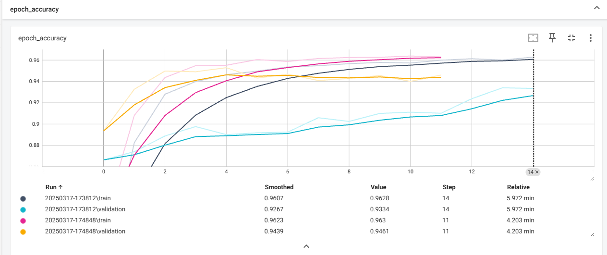
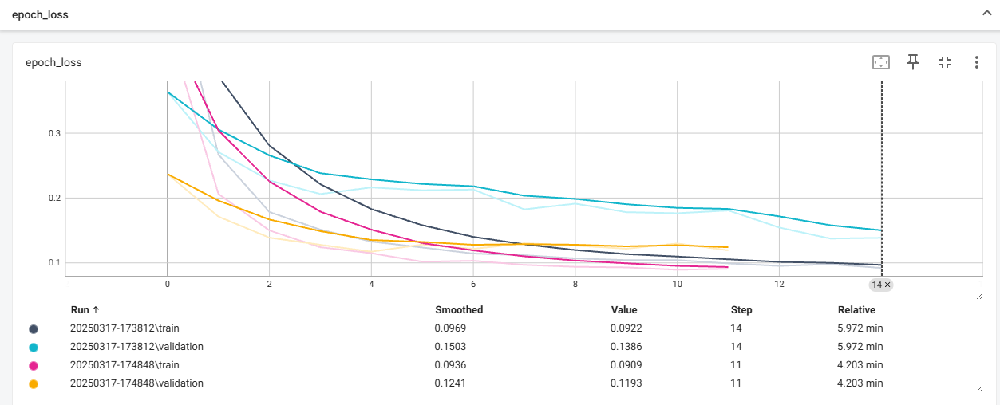
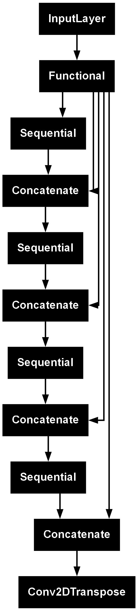

**Nucleus Segmentation using Deep Learning**

**Overview**

This project is based on the 2018 Data Science Bowl, which challenges participants to develop an algorithm for automated nucleus detection. Identifying cell nuclei is essential in medical research, as it accelerates research for diseases such as cancer, heart disease, Alzheimer’s, and diabetes. By automating nucleus detection, we can expedite drug development and improve our understanding of cellular responses to treatments.

Why Nuclei Detection?

Most human cells contain a nucleus that holds DNA, controlling cellular functions.

Detecting nuclei helps researchers analyze how cells react to treatments.

Faster nucleus detection can reduce the time required to bring new drugs to market.

**Dataset**

Source: 2018 Data Science Bowl

Structure:

Images: RGB images of cells.

Labels: Binary mask images representing nucleus locations.

Preprocessing:

Resize images and masks to 128x128.

Normalize pixel values to [0,1].

Convert mask values from [0, 255] to [0,1].

Format: Numpy arrays converted to TensorFlow tensors.

Project Workflow

1. Import Dependencies

The project utilizes TensorFlow and Keras for model development and training. OpenCV is used for image processing.

2. Load and Preprocess Data

Load input images and masks.

Convert the images from BGR to RGB and resize them.

Convert masks to binary values.

Normalize images.

Split the dataset into train and test sets using train_test_split.

Convert numpy arrays into TensorFlow datasets.

Apply data augmentation for better model generalization.

3. Model Development

The model is based on MobileNetV2 as a feature extractor.

The U-Net architecture is used for segmentation, consisting of an encoder (downsampling) and decoder (upsampling).

Concatenate layers are used to merge encoder and decoder outputs.

4. Model Training

Uses early stopping to prevent overfitting.

Trained for 40 epochs with batch size 64.

Implements TensorBoard for monitoring training progress.

5. Model Evaluation

Visualize predictions using a custom function display().

Compare input images, true masks, and predicted masks.

Model Saving

To save the trained model in .keras format:

model.save("nucleus_segmentation_model.keras")

Running TensorBoard

To monitor training:

tensorboard --logdir=seg_log

If no data appears in TensorBoard, ensure the logs are saved correctly:

Verify log_dir path in TensorBoard(log_dir=logpath).

Check that training was executed with callbacks=[tb,es,DisplayCallback()].

Epoch accuracy and Epoch loss

Architecture

Requirements

To run this project, install the required packages:

pip install tensorflow keras opencv-python matplotlib numpy scikit-learn

Conclusion

This project demonstrates how deep learning can be applied to medical image segmentation using U-Net and MobileNetV2. By automating nucleus detection, researchers can accelerate medical research and drug development.